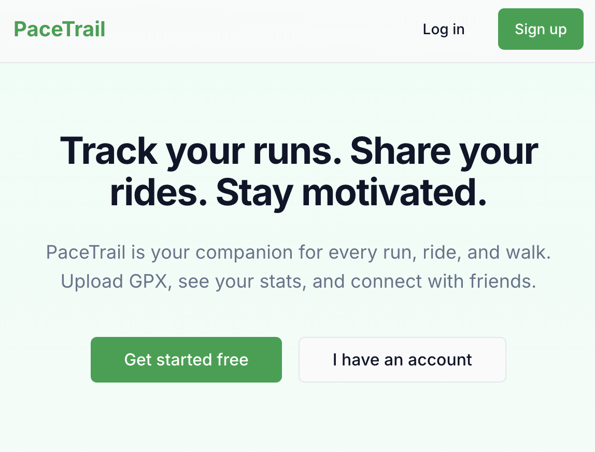

# PaceTrail

A Strava-like web app for activity tracking and social feed. Track runs, rides, and walks; upload GPX/TCX; follow users; like and comment on activities.

## Preview



- **FastAPI + Next.js** — Backend API with cookie-based auth and a modern React frontend (App Router, Tailwind, shadcn-style UI).
- **GPX/TCX processing** — Upload activities; async parsing, stats, polyline, and segment matching via RQ workers.
- **PaceRank & leaderboards** — 30-day run scoring, tiers, rank history, global and following leaderboards, FairPlay eligibility.
- **Segments & PR/KOM** — Create segments, auto-detect efforts on runs, leaderboards, PR/KOM notifications with dedupe.
- **Privacy & notifications** — Activity visibility (public/followers/private), follow/like/comment/rank_up/segment_pr/segment_kom notifications.

## Repo structure

```
Strava_clone/
├── backend/                 # FastAPI app
│   ├── app/
│   │   ├── api/
│   │   │   ├── deps.py           # Auth, DB, rate limit deps
│   │   │   └── routers/          # auth, users, activities, follows, likes, comments
│   │   ├── core/
│   │   │   ├── config.py
│   │   │   ├── database.py
│   │   │   ├── security.py       # JWT, password hashing
│   │   │   └── logging_config.py
│   │   ├── models/               # SQLAlchemy models
│   │   ├── schemas/              # Pydantic schemas
│   │   ├── repositories/
│   │   ├── services/             # Auth, User, Activity, Feed, Follow, gpx_parser
│   │   └── main.py
│   ├── alembic/
│   │   └── versions/
│   ├── scripts/
│   │   └── seed_db.py
│   ├── requirements.txt
│   ├── Dockerfile
│   └── .env.example
├── frontend/                 # Next.js App Router
│   ├── app/
│   │   ├── (auth)/             # login, signup
│   │   ├── (app)/               # feed, profile, activities
│   │   ├── layout.tsx
│   │   └── page.tsx             # Landing
│   ├── components/
│   │   ├── ui/
│   │   └── activity-map.tsx
│   ├── lib/
│   │   ├── api.ts
│   │   ├── auth-context.tsx
│   │   └── utils.ts
│   └── .env.example
├── docker-compose.yml         # db, redis, backend
├── Makefile
└── README.md
```

## Step-by-step: run locally

### 1. Backend (DB + API)

Start PostgreSQL and Redis:

```bash
make db-up
# or: docker compose up -d db redis
```

Create `.env` from example and run migrations:

```bash
cd backend
cp .env.example .env
# Edit .env if needed (DATABASE_URL, SECRET_KEY)
pip install -r requirements.txt
alembic upgrade head
```

Seed the database (5 users, 30 activities):

```bash
python -m scripts.seed_db
```

Start the API:

```bash
uvicorn app.main:app --reload --host 0.0.0.0 --port 8000
# or from repo root: make backend
```

**Activity processing (GPX/TCX uploads):** set `REDIS_URL` in `.env` (e.g. `redis://localhost:6379/0`), then run the RQ worker in a separate terminal:

```bash
make worker
# or: cd backend && rq worker default
```

API docs: http://localhost:8000/docs

### 2. Frontend

```bash
cd frontend
cp .env.example .env.local
# Set NEXT_PUBLIC_API_URL=http://localhost:8000
npm install
npm run dev
```

App: http://localhost:3000

**Auth and cookies:** The backend uses an **HttpOnly cookie** for the refresh token (cookie name: `refresh_token`). The frontend must send **credentials** with every request to the API (`credentials: "include"`) so the cookie is sent. The access token is returned in JSON and kept in memory only (not in localStorage). On 401, the client automatically calls `/auth/refresh` (with the cookie), then retries the request. Run the frontend on the same origin or an allowed CORS origin (e.g. `http://localhost:3000`) so cookies work on localhost.

### 3. Log in with seed data

- **Email:** `user1@pacetrail.demo` … `user5@pacetrail.demo`
- **Password:** `password123`

### 4. Verify Phase 2C (privacy + athlete stats)

- **Privacy:** Log in as `user1@pacetrail.demo`. View `user2@pacetrail.demo`’s profile: you should see only their public + followers-only activities (user1 follows user2). View `user3@pacetrail.demo`: you should see only public activities. Open a private activity (e.g. one of user2’s private activities by ID if you know it) → “This activity is private” with links to feed/profile.
- **Stats:** On your profile and on others’ profiles, use the **Stats** card: switch 7d / 30d / YTD, check weekly distance chart (last 12 weeks) and by-sport breakdown. Seed data spreads activities over 12 weeks with varied distances so the chart is non-flat.

### 5. Verify PaceRank (runner ranking)

- **Profile rank:** Log in as `user1@pacetrail.demo` and go to `/profile`. You should see a **PaceRank** section at the top of the Stats card with a rank badge (tier name), score, progress bar, breakdown (runs, distance, average speed), and a **rank history chart** (last 30 days). Click "Recompute" to refresh your rank; if your tier increases, you'll see a "Rank Up!" toast.
- **Public profile rank:** View another user's profile (e.g., `/profile/{user2_id}`). You should see their PaceRank badge, score, progress, and **public-only history chart** (based on runs you can view).
- **Leaderboard:** Open `/leaderboard` from the top nav. You should see tabs: **Global** (all runners) and **Following** (only users you follow). Both show tier badge, score, and public runs/distance over the last 30 days. Leaderboards are cached for 60 seconds.
- **Rank-up notifications:** Go to `/notifications`. If you've ranked up, you should see a "Rank Up! You reached {tier name}" notification with a link to your profile.

## Athlete stats API (Phase 2C)

| Endpoint | Description |
|----------|-------------|
| `GET /api/v1/athletes/me/summary?range=7d,30d,ytd` | Your summary (totals + by sport) in the given range. |
| `GET /api/v1/athletes/{id}/summary?range=7d,30d,ytd` | Another athlete’s summary (only viewable activities). |
| `GET /api/v1/athletes/me/weeks?weeks=12` | Your weekly distance for the last N weeks (Monday-based). |
| `GET /api/v1/athletes/{id}/weeks?weeks=12` | Another athlete’s weekly distance (only viewable). |

All use UTC boundaries; YTD from Jan 1 UTC. Only READY and viewable activities are included.

## PaceRank API (runner ranking)

- Ranks are based on **last 30 days of READY RUN activities** only.
- Each run contributes points based on:
  - Distance (non-linear scaling),
  - Speed (relative to ~10 km/h baseline),
  - Elevation gain (capped),
  - Calories (capped),
  - Plus a consistency bonus (more runs and more active days → higher multiplier).
- Tier thresholds (approximate bands):
  - **Bronze Trailblazer** (`bronze`): score \< 40
  - **Silver Strider** (`silver`): 40–\<80
  - **Gold Pacemaker** (`gold`): 80–\<130
  - **Platinum Marathoner** (`platinum`): 130–\<190
  - **Diamond Elite** (`diamond`): 190–\<260
  - **World Class Legend** (`world_class`): 260+

### PaceRank endpoints

| Endpoint | Description |
|----------|-------------|
| `GET /api/v1/ranks/me` | Get your current PaceRank (tier, score, progress, optional breakdown). Lazily recomputes if stale. |
| `POST /api/v1/ranks/me/recompute` | Enqueue async rank recompute job. Returns `{status: "queued", job_id}`. Falls back to sync if Redis unavailable. |
| `GET /api/v1/ranks/me/recompute/{job_id}` | Get status of rank recompute job. Returns `{status: "queued|started|finished|failed", result?: RankMeResponse, error?: str}`. |
| `GET /api/v1/ranks/tiers` | List available tiers, names, and score thresholds. |
| `GET /api/v1/ranks/leaderboards/runs?range=30d&limit=50` | Global leaderboard of runners ordered by `rank_score` (only users with at least 1 public READY RUN in range, rank_eligible=true). Cached 60s. |
| `GET /api/v1/ranks/leaderboards/runs/following?range=30d&limit=50` | Following-only leaderboard (users you follow + yourself). Requires auth. Cached 60s. |
| `GET /api/v1/ranks/users/{id}` | Public-facing rank for a specific user, using only runs viewable to the requester (public + followers-only when following; excludes private). |
| `GET /api/v1/ranks/me/history?days=30` | Your rank history (private scope) - daily snapshots of tier and score. |
| `GET /api/v1/ranks/users/{id}/history?days=30` | Rank history for a user. Returns private scope if you're viewing your own, else public scope (public-only runs). |

**Rank history:** Daily snapshots are created automatically when ranks are recomputed. Private scope includes all runs (owner view); public scope uses only public runs (safe for profile viewers). History endpoints return snapshots sorted by date ascending.

**FairPlay (Phase 3):** Activities have `rank_eligible` (boolean) and `rank_excluded_reason` (string) fields. Suspicious runs (max speed ≥28 km/h, avg speed ≥22 km/h, unrealistic distance/time, or too short) are automatically excluded from PaceRank calculations. Activity detail page shows "Excluded from PaceRank" notice for ineligible runs.

**Async recompute:** Rank recomputation runs asynchronously via RQ when Redis is available. Frontend polls job status every 1s up to 30s. Falls back to synchronous recompute if Redis unavailable.

**Daily job:** Run `make ranks-daily` (or `python -m scripts.daily_rank_job`) to recompute ranks for all users. In production, wire to cron or scheduler.

### Segments (Phase 4)

Segments are named route snippets (encoded polylines) that can have leaderboards and personal records (PRs), similar to Strava.

- **Tables:** `segments` (definition, owner, polyline, distance, is_public) and `segment_efforts` (links segment → activity → user, with effort time/distance/speed and visibility snapshot).
- **Matching logic:** When a RUN activity is processed from GPX/TCX and becomes READY, the worker:
  - downsamples activity points and public/user-owned segment polylines,
  - tries to match each segment using a simple heuristic (nearest activity point for each segment point, within 40m, monotonic indices, ≥80% of points matched),
  - if matched, computes `effort_time_s` and `effort_distance_m` over the window and inserts a `segment_effort`.
- **Privacy:** Segment **leaderboards** include only PUBLIC efforts (activities with `visibility = "public"`). Your own efforts on private activities appear on:
  - the activity detail page (`Segments` section) and
  - the segment detail page under **My Efforts**,
  but are excluded from the public leaderboard.
- **APIs:**
  - `POST /api/v1/segments` – create segment `{name, description?, polyline, is_public}`.
  - `GET /api/v1/segments?query=&limit=&offset=` – browse public segments.
  - `GET /api/v1/segments/{id}` – segment detail (only owner can see private segments).
  - `GET /api/v1/segments/{id}/leaderboard` – best public efforts ordered by time.
  - `GET /api/v1/segments/{id}/my-efforts` – authenticated user’s efforts on this segment (includes private).
- **Frontend:**
  - `/segments` – browse segments, search by name, link to `/segments/new`.
  - `/segments/new` – create a new segment from an encoded polyline.
  - `/segments/[id]` – segment detail with MapLibre preview, **Leaderboard** tab (public efforts only), **My Efforts** tab (with PR badge).
  - `/activities/[id]` – activity detail shows a `Segments` section listing matched efforts (time, avg speed, PR badge) with links to segment pages.

**Backfill:** For dev/test, run `python -m scripts.backfill_segment_efforts --days 30` to scan recent READY RUN activities and recompute efforts. The script loads TrackPoints with timestamps, matches segments, and creates efforts. Use `--limit-activities` to cap the scan, or `--segment-ids` to target specific segments.

**PR/KOM Notifications:** When a new `SegmentEffort` is created (via GPX processing or backfill), the system automatically checks if it's a PR (user's best on that segment) or KOM (fastest public effort). Notifications are created only if:
- The new effort is strictly better than the previous best by ≥1 second
- For KOM: the activity must be PUBLIC
- Notifications are deduplicated per user+segment using `dedupe_key`, so re-running backfill won't create duplicates

### Automated Verification

Run `make verify` (or `python -m scripts.verify_e2e`) to perform end-to-end checks:

- Environment and DB connectivity
- Migration status
- Database seeding
- API endpoint tests (auth, PaceRank, segments, activities, notifications)
- DB assertions (segment counts, effort counts, dedupe_key uniqueness, leaderboard sorting)

**Prerequisites:** Backend must be running (`make backend`). The script will seed the database if needed and test against `http://localhost:8000` by default (use `--api-url` to override).

Example output:
```
✅ DATABASE_URL set
✅ DB connectivity
✅ Migrations applied: Current: 011
✅ Seed completed
✅ POST /auth/login
✅ GET /ranks/me: Tier: gold
✅ GET /segments: 3 segments
...
VERIFICATION REPORT
Total checks: 25
Passed: 25
Failed: 0
```

## Privacy and visibility rules

- **Visibility:** Each activity has `visibility`: `public`, `followers`, or `private`.
- **Who can view:** Owner always; others: `public` → always; `followers` → only if the requester follows the owner; `private` → never.
- **Enforced on:** `GET /activities/{id}`, `GET /activities/{id}/stream`, `GET /activities/user/{id}` (list filtered). `GET /activities/{id}/status` is **owner-only** (403 for non-owner).

## Commands summary

| Command        | Description                    |
|----------------|--------------------------------|
| `make db-up`   | Start PostgreSQL + Redis       |
| `make db-down` | Stop Docker services           |
| `make migrate` | Run Alembic migrations         |
| `make seed`    | Seed 5 users + 30 activities   |
| `make backend` | Run FastAPI (reload)           |
| `make worker`  | Run RQ worker (activity processing + rank recompute) |
| `make frontend`| Run Next.js dev                |
| `make install` | Install backend + frontend deps|
| `make ranks-daily` | Run daily rank recompute job for all users |
| `make verify` | Run end-to-end verification (requires backend running) |

## What was built

- **Backend:** Auth (signup, login, refresh with **cookie-based refresh token**, rotation, server-side sessions in `refresh_sessions`), users (me, update, search), activities (CRUD, GPX/TCX upload with async processing via RQ, polyline, stats), feed (paginated, sport/date filters), follows, likes, comments, **notifications** (follow/like/comment/**rank_up**). Activity status: draft/processing/ready/failed; `GET /activities/{id}/status`, `GET /activities/{id}/stream` (downsampled points). Notifications: `GET /notifications` (cursor), `GET /notifications/unread-count`, `POST /notifications/mark-read`. **Privacy:** Activity visibility (`public` | `followers` | `private`); owner can always view; others see public always, followers-only if requester follows owner, private never. Visibility enforced on `GET /activities/{id}`, `GET /activities/{id}/stream`, `GET /activities/user/{id}`; `GET /activities/{id}/status` is owner-only (403 for non-owner). **Athlete stats:** `GET /athletes/me/summary?range=7d|30d|ytd`, `GET /athletes/{id}/summary?range=...`, `GET /athletes/me/weeks?weeks=12`, `GET /athletes/{id}/weeks?weeks=...` (totals, by-sport, weekly distance; only READY + viewable activities). **PaceRank Phase 2:** Daily rank snapshots (`rank_snapshots` table with private/public scope), rank history endpoints (`/ranks/me/history`, `/ranks/users/{id}/history`), rank-up notifications (created when tier increases), following-only leaderboard (`/ranks/leaderboards/runs/following`), Redis caching for leaderboards (60s TTL). Structured logging, request ID, CORS, rate-limit stub, OpenAPI.
- **DB:** PostgreSQL, SQLAlchemy 2.0, Alembic, models: User, Activity, TrackPoint, Follow, Like, Comment, RefreshSession, Notification. Polyline + derived stats (no PostGIS).
- **Frontend:** Next.js 14 App Router, TypeScript, Tailwind, shadcn-style UI. Landing, Login, Signup, Feed, Profile (own + public), Activity create (form + file upload), Activity detail (map, splits, comments), **Notifications** page (supports rank_up type), **Leaderboard** page (Global + Following tabs). Top nav: logo, user search, Create, bell with unread badge, Profile, Leaderboard, logout. **Profile stats:** Stats card with PaceRank section (badge, score, progress, breakdown for me; badge/score/progress for others), rank history chart (line chart of score over last 30 days), 7d/30d/YTD range tabs, weekly distance chart (last 12 weeks), by-sport breakdown; "Recompute" button for own profile with rank-up toast; activity detail shows “This activity is private” on 403 with link to feed/profile. Access token in memory; refresh via HttpOnly cookie; 401 → refresh then retry. Toasts for errors/success. MapLibre map with OSM-style tiles for route.

## What to build next

See [WHAT_NEXT.md](WHAT_NEXT.md) for a short list of follow-up features (segments, challenges, leaderboards, notifications, etc.).
